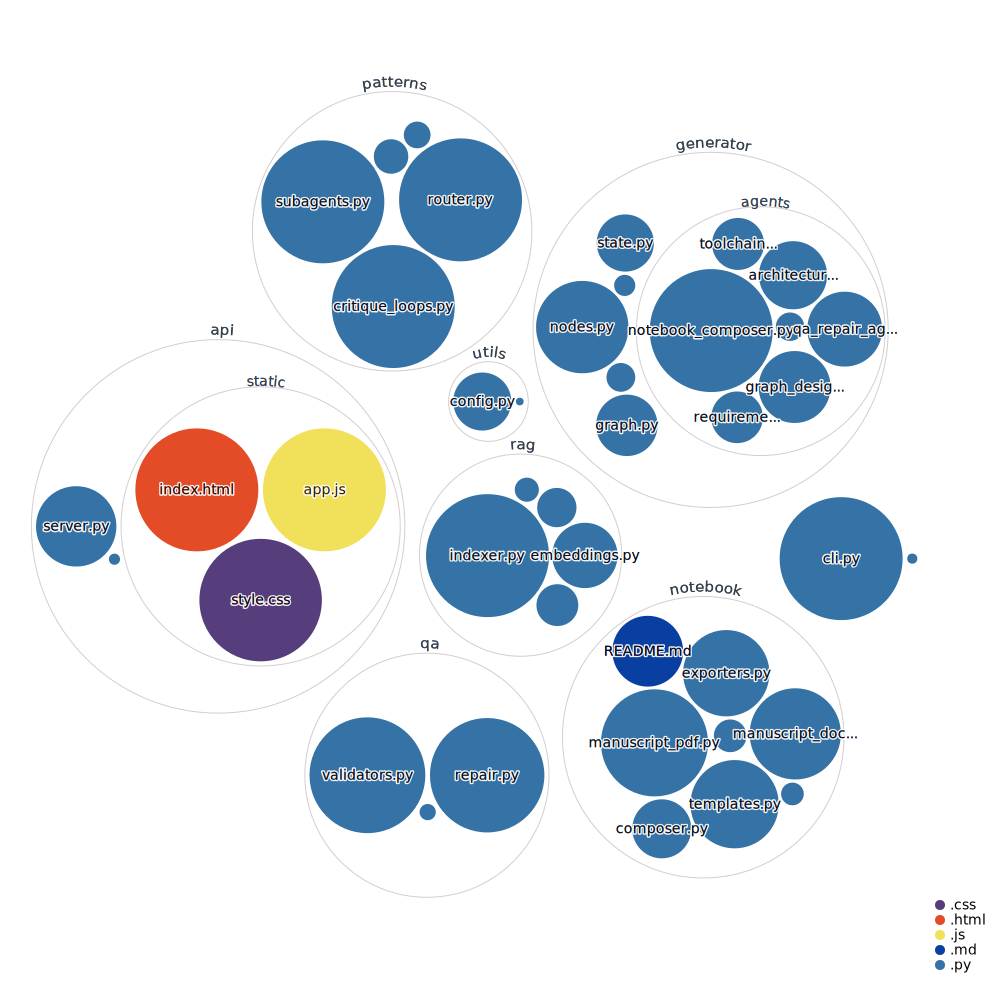

# langgraph_system_generator

Prompt -> Full Agentic System. Generates entire multiagent systems based on user constraints in a simple text prompt.

## Features

- **Web Interface**: Modern, user-friendly web UI for generating systems without code
- **RAG-Powered Documentation**: Includes precached LangGraph and LangChain documentation for offline use
- **Pattern Library**: Built-in support for common multi-agent patterns
- **Production-Ready**: Generates complete, runnable Jupyter notebooks

## Quickstart

1. Create a virtual environment and install dependencies:
   ```bash
   python -m venv .venv
   source .venv/bin/activate  # Windows: .venv\Scripts\activate
   pip install -r requirements.txt
   ```

2. Copy `.env.example` to `.env` and add your API keys.

3. (Optional) Build the vector index from precached docs:
   ```bash
   python scripts/build_index.py
   ```
   
   Note: The documentation has already been scraped and cached in `data/cached_docs/`. 
   You only need to run this if you have an OpenAI API key and want to build the 
   vector index for semantic search.

4. Run the test scaffold to verify imports:
   ```bash
   python -m pytest
   ```

## CLI

Use the bundled CLI (stub mode by default) to generate scaffold artifacts or rebuild the vector index:

```bash
# Generate offline-friendly artifacts from a prompt
lnf generate "Create a router-based chatbot" --output ./output/demo --mode stub

# Generate specific output formats (default: all formats)
lnf generate "Create a chatbot" --output ./output/demo --formats ipynb html docx

# Build the FAISS index from cached docs with fake embeddings (no API key needed)
lnf build-index --cache ./data/cached_docs --store ./data/vector_store
```

Pass `--mode live` to `lnf generate` when you have `OPENAI_API_KEY` configured and want to invoke the full generator graph.

### Output Formats

The generator produces the following artifacts:

- **JSON artifacts**: `manifest.json`, `notebook_plan.json`, `generated_cells.json` for programmatic access
- **Jupyter Notebook** (`.ipynb`): Fully functional notebook ready to run in Jupyter or Google Colab
- **HTML** (`.html`): Web-ready notebook export for viewing and sharing
- **DOCX** (`.docx`): Microsoft Word document for documentation and editing
- **PDF** (`.pdf`): Print-ready PDF document (requires additional dependencies)
- **ZIP Bundle** (`.zip`): Complete package with notebook and all JSON artifacts

Use the `--formats` option to select specific formats (default: generates all except PDF):

```bash
lnf generate "Create a chatbot" --formats ipynb html docx zip
```

## Web Interface

A modern web interface is available for easy system generation:

```bash
uvicorn langgraph_system_generator.api.server:app --host 0.0.0.0 --port 8000
```

Then open your browser to `http://localhost:8000` to access the web UI.

### Features

- **Interactive Form**: Enter your system requirements in natural language
- **Mode Selection**: Choose between stub mode (fast, no API key) or live mode (full LLM generation)
- **Advanced Options**: Customize model, temperature, max tokens, agent type, and memory configuration
- **Theme Toggle**: Switch between dark and light themes
- **Progress Tracking**: Real-time progress bar with detailed generation steps
- **Generation History**: Track and reuse previous configurations
- **Export Options**: Download notebooks in multiple formats (IPYNB, HTML, DOCX, PDF, ZIP)
- **Results Display**: View generated artifacts with download links
- **Responsive Design**: Works on desktop and mobile devices
- **Accessibility**: Full keyboard navigation and screen reader support

See [WEB_UI_ENHANCEMENTS.md](docs/WEB_UI_ENHANCEMENTS.md) for detailed documentation of all features.


## API

The FastAPI server also exposes REST endpoints:

Endpoints:

- `GET /` – web interface
- `GET /health` – health check
- `POST /generate` – generate artifacts (supports `stub`/`live` modes; defaults to `stub`)

Example API usage:

```bash
curl -X POST http://localhost:8000/generate \
  -H "Content-Type: application/json" \
  -d '{
    "prompt": "Create a customer support chatbot with routing",
    "mode": "stub",
    "output_dir": "./output/my_system",
    "formats": ["ipynb", "html", "docx", "zip"]
  }'
```

The API response includes paths to all generated artifacts in the manifest:

```json
{
  "success": true,
  "mode": "stub",
  "prompt": "Create a customer support chatbot with routing",
  "manifest": {
    "notebook_path": "./output/my_system/notebook.ipynb",
    "html_path": "./output/my_system/notebook.html",
    "docx_path": "./output/my_system/notebook.docx",
    "zip_path": "./output/my_system/notebook_bundle.zip",
    "plan_path": "./output/my_system/notebook_plan.json",
    "cells_path": "./output/my_system/generated_cells.json"
  }
}
```

You can also containerize the application:

```bash
docker build -t lnf .
docker run -p 8000:8000 \
  -e OPENAI_API_KEY=sk-... \
  -v $(pwd)/output:/app/output \
  lnf
```

## Pattern Library

The system includes a powerful pattern library for generating common multi-agent architectures. Three core patterns are available:

### Router Pattern
Dynamic routing to specialized agents based on input classification. Ideal for modular systems with domain-specific expertise.

```python
from langgraph_system_generator.patterns import RouterPattern

# Generate a complete router-based system
routes = ["search", "analyze", "summarize"]
route_purposes = {
    "search": "Search for information",
    "analyze": "Analyze data and identify patterns",
    "summarize": "Condense content into summaries",
}

code = RouterPattern.generate_complete_example(routes, route_purposes)
# Returns fully functional LangGraph workflow code
```

### Subagents Pattern
Supervisor-based coordination of specialized agents for complex, multi-step workflows.

```python
from langgraph_system_generator.patterns import SubagentsPattern

# Generate a research team with supervisor
subagents = ["researcher", "analyst", "writer"]
descriptions = {
    "researcher": "Gathers information from multiple sources",
    "analyst": "Analyzes data and identifies patterns",
    "writer": "Creates comprehensive reports",
}

code = SubagentsPattern.generate_complete_example(subagents, descriptions)
# Returns supervisor-subagent coordination system
```

### Critique-Revise Loop Pattern
Iterative quality improvement through cycles of generation, critique, and revision.

```python
from langgraph_system_generator.patterns import CritiqueLoopPattern

# Generate content refinement system
task = "Write technical documentation"
criteria = ["Technical accuracy", "Clarity", "Completeness", "Code examples"]

code = CritiqueLoopPattern.generate_complete_example(
    task_description=task,
    criteria=criteria,
    max_revisions=3,
)
# Returns iterative refinement workflow
```

### Examples and Documentation

- **Comprehensive Documentation**: See [docs/patterns.md](docs/patterns.md) for detailed pattern guide
- **Runnable Examples**: Check `examples/` directory for practical demonstrations:
  - `examples/router_pattern_example.py` - Router pattern usage
  - `examples/subagents_pattern_example.py` - Subagents pattern usage
  - `examples/critique_revise_pattern_example.py` - Critique-revise pattern usage
- **Test Coverage**: ≥90% coverage for all pattern modules (see `tests/unit/test_patterns.py`)

Run an example:
```bash
export OPENAI_API_KEY='your-key-here'
python examples/router_pattern_example.py
```

## Precached Documentation

This repository includes precached LangGraph and LangChain documentation (19+ pages, ~300KB) 
in `data/cached_docs/`. All redirect pages and minimal content are automatically filtered 
to ensure high-quality documentation. This enables:

- **Offline use** without needing to scrape documentation
- **Faster startup** times
- **Consistent** documentation across environments

See `data/cached_docs/README.md` for more details.

See `docs/dev.md` for additional setup details.

```mermaid
classDiagram
  class ArchitectureSelector {
    docs_retriever : DocsRetriever | None
    llm : ChatOpenAI
    select_architecture(constraints: List[Constraint], docs_context: List[DocSnippet]) Dict[str, Any]
  }
  class CellSpec {
    cell_type : Optional[str]
    content : Optional[str]
    metadata : Optional[Dict[str, Any]]
    section : Optional[str]
  }
  class Constraint {
    priority : Optional[int]
    type : Optional[str]
    value : Optional[str]
  }
  class CritiqueLoopPattern {
    generate_complete_example(task_description: str, criteria: Optional[List[str]], max_revisions: int) str
    generate_conditional_edge_code(max_revisions: int, min_quality_score: float) str
    generate_critique_node_code(criteria: Optional[List[str]], llm_model: str, use_structured_output: bool) str
    generate_generation_node_code(task_description: str, llm_model: str) str
    generate_graph_code(max_revisions: int, min_quality_score: float) str
    generate_revise_node_code(llm_model: str) str
    generate_state_code(additional_fields: Optional[Dict[str, str]]) str
  }
  class DocSnippet {
    content : Optional[str]
    heading : Optional[str]
    relevance_score : Optional[float]
    source : Optional[str]
  }
  class DocsIndexer {
    DOCS_URLS
    LANGCHAIN_AGENTS_URLS : list
    LANGCHAIN_CHAINS_URLS : list
    LANGCHAIN_CORE_URLS : list
    LANGCHAIN_RAG_URLS : list
    LANGGRAPH_ADVANCED_URLS : list
    LANGGRAPH_CORE_URLS : list
    LANGGRAPH_PATTERNS_URLS : list
    LANGGRAPH_STATE_URLS : list
    chunk_overlap : int
    chunk_size : int
    request_timeout : float
    urls : list
    chunk_documents(docs: List[Document]) List[Document]
    scrape_docs() List[Document]
  }
  class DocsRetriever {
    vector_store_manager : VectorStoreManager
    retrieve(query: str, k: int) List[RetrievedSnippet]
    retrieve_for_pattern(pattern_name: str) List[RetrievedSnippet]
  }
  class DocumentCache {
    cache_file
    cache_path : Path
    exists() bool
    load_documents() List[Document]
    save_documents(documents: List[Document]) None
  }
  class GenerationArtifacts {
    manifest : Dict[str, Any]
    manifest_path : str
    mode : Literal
    output_dir : str
    prompt : str
    result : Dict[str, Any]
  }
  class GenerationRequest {
    agent_type : Optional[str]
    custom_endpoint : Optional[str]
    document_loader : Optional[str]
    formats : Optional[list[str]]
    graph_style : Optional[str]
    max_tokens : Optional[int]
    memory_config : Optional[str]
    mode : Optional[GenerationMode]
    model : Optional[str]
    output_dir : Optional[str]
    preset : Optional[str]
    prompt : Optional[str]
    retriever_type : Optional[str]
    temperature : Optional[float]
  }
  class GenerationResponse {
    error : Optional[str]
    manifest : Optional[Dict[str, Any]]
    manifest_path : Optional[str]
    mode : Optional[str]
    output_dir : Optional[str]
    prompt : Optional[str]
    success : bool
  }
  class GeneratorState {
    architecture_justification : str
    architecture_type : Optional[str]
    artifacts_manifest : Dict[str, str]
    constraints : Annotated[List[Constraint], operator.add]
    docs_context : Annotated[List[DocSnippet], operator.add]
    error_message : Optional[str]
    generated_cells : Annotated[List[CellSpec], operator.add]
    generation_complete : bool
    notebook_plan : Optional[NotebookPlan]
    qa_reports : List[QAReport]
    repair_attempts : int
    selected_patterns : Dict[str, Any]
    tools_plan : Optional[List[Dict[str, Any]]]
    uploaded_files : Optional[List[str]]
    user_prompt : str
    workflow_design : Optional[Dict[str, Any]]
  }
  class GraphDesigner {
    llm : ChatOpenAI
    design_workflow(architecture: Dict[str, Any], constraints: List[Constraint]) Dict[str, Any]
  }
  class ManuscriptDOCXGenerator {
    font_name : str
    font_size : int
    line_spacing : float
    create_manuscript(title: str, author: str | None, chapters: Sequence[Dict[str, Any]] | None, output_path: str | Path, include_title_page: bool) str
    create_notebook_manuscript(notebook_cells: Sequence[Dict[str, Any]], output_path: str | Path, title: str | None, author: str | None) str
  }
  class ManuscriptPDFGenerator {
    body_style : ParagraphStyle
    chapter_style : ParagraphStyle
    code_style : ParagraphStyle
    font_name : str
    font_size : int
    page_size : tuple
    section_style : ParagraphStyle
    styles : StyleSheet1
    subsection_style : ParagraphStyle
    create_manuscript(title: str, chapters: Sequence[Dict[str, Any]], output_path: str | Path, author: str | None, include_title_page: bool) str
    create_notebook_manuscript(notebook_cells: Sequence[Dict[str, Any]], output_path: str | Path, title: str | None, author: str | None) str
  }
  class NotebookComposer {
    llm : ChatOpenAI
    compose_notebook(notebook_plan: NotebookPlan, workflow_design: Dict[str, Any], tools: List[Dict[str, Any]], architecture: Dict[str, Any]) List[CellSpec]
  }
  class NotebookComposer {
    colab_friendly : bool
    build_notebook(cells: Sequence[CellSpec], ensure_minimum_sections: bool) NotebookNode
    write(notebook: NotebookNode, path: str | Path) str
  }
  class NotebookExporter {
    export_ipynb(notebook: nbformat.NotebookNode, path: str | Path) str
    export_notebook_to_docx(notebook: nbformat.NotebookNode, output_path: str | Path, title: str | None) str
    export_to_html(notebook: nbformat.NotebookNode, output_path: str | Path) str
    export_to_pdf(notebook_path: str | Path, output_path: str | Path, method: str) str
    export_zip(notebook: nbformat.NotebookNode, zip_path: str | Path, extra_files: Sequence[str | os.PathLike[str]] | None, notebook_name: str) str
  }
  class NotebookPlan {
    architecture_type : Optional[str]
    cell_count_estimate : Optional[int]
    patterns_used : Optional[List[str]]
    sections : Optional[List[str]]
    title : Optional[str]
  }
  class NotebookRepairAgent {
    DEFAULT_MAX_ATTEMPTS : int
    max_attempts : int
    validator : NotebookValidator
    get_repair_summary(qa_reports: List[QAReport]) Dict[str, Any]
    repair_notebook(notebook_path: str | Path, qa_reports: List[QAReport], attempt: int) tuple[bool, List[QAReport]]
    should_retry(qa_reports: List[QAReport], attempt: int) bool
  }
  class NotebookValidator {
    PLACEHOLDER_PATTERNS : list
    REQUIRED_IMPORTS : list
    REQUIRED_SECTIONS : list
    check_graph_compiles(notebook_path: str | Path) QAReport
    check_imports_present(notebook_path: str | Path, required_imports: Optional[List[str]]) QAReport
    check_no_placeholders(notebook_path: str | Path) QAReport
    check_required_sections(notebook_path: str | Path, required_sections: Optional[List[str]]) QAReport
    validate_all(notebook_path: str | Path) List[QAReport]
    validate_json_structure(notebook_path: str | Path) QAReport
  }
  class QARepairAgent {
    llm : ChatOpenAI
    repair(cells: List[CellSpec], qa_reports: List[QAReport]) List[CellSpec]
    validate(cells: List[CellSpec]) List[QAReport]
  }
  class QAReport {
    check_name : Optional[str]
    message : Optional[str]
    passed : Optional[bool]
    suggestions : Optional[List[str]]
  }
  class RequirementsAnalyst {
    llm : ChatOpenAI
    analyze(prompt: str) List[Constraint]
  }
  class RetrievedSnippet {
    content : str
    heading : Optional[str]
    relevance_score : float
    source : str
  }
  class RouterPattern {
    generate_complete_example(routes: List[str], route_purposes: Optional[Dict[str, str]]) str
    generate_graph_code(routes: List[str], entry_point: str, use_conditional_edges: bool) str
    generate_route_node_code(route_name: str, route_purpose: str, llm_model: str) str
    generate_router_node_code(routes: List[str], llm_model: str, use_structured_output: bool) str
    generate_state_code(additional_fields: Optional[Dict[str, str]]) str
  }
  class Settings {
    anthropic_api_key : Optional[str]
    default_budget_tokens : Optional[int]
    default_model : Optional[str]
    langsmith_api_key : Optional[str]
    langsmith_project : Optional[str]
    max_repair_attempts : Optional[int]
    model_config : SettingsConfigDict
    openai_api_key : Optional[str]
    vector_store_path : Optional[str]
    vector_store_type : Optional[str]
  }
  class SubagentsPattern {
    generate_complete_example(subagents: List[str], subagent_descriptions: Optional[Dict[str, str]]) str
    generate_graph_code(subagents: List[str], max_iterations: int) str
    generate_state_code(additional_fields: Optional[Dict[str, str]]) str
    generate_subagent_code(agent_name: str, agent_description: str, llm_model: str, include_tools: bool) str
    generate_supervisor_code(subagents: List[str], subagent_descriptions: Optional[Dict[str, str]], llm_model: str, use_structured_output: bool) str
  }
  class ToolchainEngineer {
    llm : ChatOpenAI
    plan_tools(workflow_design: Dict[str, Any], constraints: List[Constraint]) List[Dict[str, Any]]
  }
  class VectorStoreManager {
    embeddings : OpenAIEmbeddings
    store_path : str
    vector_store : Optional[FAISS]
    create_index(documents: List[Document]) FAISS
    index_exists() bool
    load_index() FAISS
    load_or_create(documents: List[Document]) FAISS
  }
```




