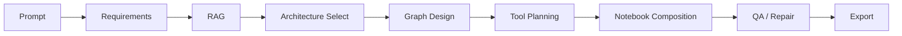
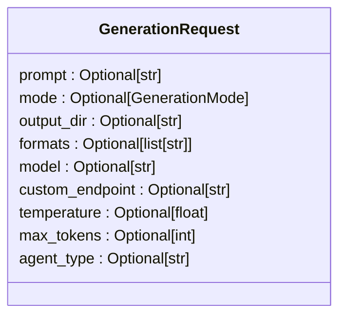

# langgraph_system_generator

Prompt -> full agentic system. LangGraph System Generator, also called LNF,
turns a natural-language request into runnable LangGraph notebook artifacts,
exports, and structured QA feedback.


## Features

- **CLI, API, and web UI**: Generate from `lnf`, FastAPI, or the browser UI.
- **Offline-friendly stub mode**: Produce deterministic scaffold artifacts
  without API keys.
- **Live generation mode**: Use an OpenAI-compatible model for requirements,
  architecture, graph, tool, and notebook generation.
- **Registry-backed planning**: Architecture, graph design, tool planning,
  notebook composition, and QA/repair stages expose structured feedback.
- **Portable notebooks**: Generated notebooks target local Jupyter and Google
  Colab.
- **Multi-format export**: Write IPYNB, HTML, Markdown, DOCX, ZIP, and optional
  PDF outputs.

## Quickstart

1. Create a Python `3.10+` virtual environment and install the package:

   ```bash
   python -m venv .venv
   source .venv/bin/activate  # Windows: .venv\Scripts\activate
   pip install -r requirements.txt
   pip install -e ".[full]"
   ```

   Install profiles:

   - `pip install -e .` installs the core Python package/config/types only.
   - `pip install -e ".[api]"` installs the FastAPI/web server.
   - `pip install -e ".[full]"` installs notebook generation, export, and live-mode dependencies.
   - `pip install -e ".[full,dev]"` installs contributor/test tooling.

2. Copy `.env.example` to `.env` and add credentials when you need live mode:

   ```bash
   cp .env.example .env
   ```

   Stub mode does not need provider credentials. Live mode requires
   `OPENAI_API_KEY` unless you provide an OpenAI-compatible `custom_endpoint`
   and explicit `model` through the API.

3. Optionally build the vector index from cached docs:

   ```bash
   lnf build-index --cache ./data/cached_docs --store ./data/vector_store
   ```

   The default index build uses local fake embeddings for offline testing. Add
   `--use-openai` when `OPENAI_API_KEY` is configured and you want OpenAI-backed
   semantic retrieval.

4. Generate your first system:

   ```bash
   lnf generate "Create a router-based customer support chatbot" \
     --output ./output/demo \
     --mode stub
   ```

5. Run the test suite when developing:

   ```bash
   python -m pytest --asyncio-mode=auto
   ```

## How It Works

LNF uses a staged outer LangGraph workflow to turn a prompt into notebook
artifacts.


```mermaid
graph LR
    Prompt[Prompt] --> Requirements[Requirements]
    Requirements --> RAG[RAG]
    RAG --> Architecture[Architecture Select]
    Architecture --> Graph[Graph Design]
    Graph --> Tools[Tool Planning]
    Tools --> Notebook[Notebook Composition]
    Notebook --> QA[QA / Repair]
    QA --> Export[Export]
```

Pipeline stages:

1. **Prompt**: The CLI, API, or web UI collects request options.
2. **Requirements**: `RequirementsAnalyst` extracts typed constraints plus
   advisory feedback.
3. **RAG**: `DocsRetriever` provides cached LangChain/LangGraph context.
4. **Architecture**: `ArchitectureSelector` chooses `router`, `subagents`,
   `hybrid`, or `autoagent`.
5. **Graph Design**: `GraphDesigner` returns a typed graph design, Mermaid
   export, schema export, and validation feedback.
6. **Tool Planning**: `ToolchainEngineer` normalizes tools through a registry,
   applies environment constraints, deduplicates tools, and surfaces warnings.
7. **Notebook Composition**: `NotebookComposer` builds cells, a dependency
   plan, fallback feedback, and a graph overview section.
8. **QA / Repair**: Static/runtime QA validate the notebook; deterministic
   registry-backed repair runs only when needed and records rollback/no-op
   outcomes.
9. **Export**: The CLI/API export layer writes files and a manifest with
   structured feedback and warnings.

For a code-level walkthrough, see
[docs/wiki/Architecture-Deep-Dive.md](docs/wiki/Architecture-Deep-Dive.md).
For a maintainer-focused stage/state map, see
[docs/diagrams/README.md](docs/diagrams/README.md).

## CLI

Generate artifacts:

```bash
# Stub mode, no API key required
lnf generate "Create a router-based chatbot" --output ./output/demo --mode stub

# Force an architecture
lnf generate "Create an autonomous planning assistant" \
  --mode stub \
  --agent-type autoagent

# Select output formats. Default: ipynb html markdown docx zip
lnf generate "Create a chatbot" \
  --output ./output/demo \
  --formats ipynb html markdown docx zip
```

Build the docs index:

```bash
# Offline test index
lnf build-index

# OpenAI-backed semantic index
lnf build-index --use-openai
```

CLI options intentionally stay narrow. Use the API for request-scoped `model`,
`temperature`, `max_tokens`, or `custom_endpoint` overrides.

## Outputs

Successful generations can include:

- `manifest.json`: Generation metadata, structured feedback, warnings, and
  per-format export status.
- `notebook_plan.json`: Notebook planning metadata.
- `generated_cells.json`: Raw cell specifications.
- `notebook.ipynb`: Runnable Jupyter/Colab notebook.
- `notebook.html`: HTML export.
- `notebook.md`: Markdown export.
- `notebook.docx`: Word document export.
- `notebook.pdf`: Optional PDF export.
- `notebook_bundle.zip`: Bundle with the notebook, requested exports, and JSON
  artifacts.

The manifest includes advisory fields such as `requirements_feedback`,
`architecture_feedback`, `graph_design_feedback`, `graph_exports`,
`tool_planning_feedback`, `notebook_composition_feedback`,
`notebook_dependency_plan`, and `qa_repair_feedback`. These are response/output
fields, not new request fields.

## API And Web UI

Start the FastAPI server:

```bash
uvicorn langgraph_system_generator.api.server:app --host 0.0.0.0 --port 8000
```

Open `http://localhost:8000` for the web UI.

REST endpoints:

- `GET /`: Web interface.
- `GET /health`: Health check.
- `POST /generate`: Synchronous generation.
- `POST /generate-async`: Start an async generation job.
- `GET /stream/{job_id}`: Server-Sent Events progress stream. Supports
  `Last-Event-ID` replay.
- `GET /artifacts`: Download generated artifacts listed in the manifest.

Example:

```bash
curl -X POST http://localhost:8000/generate \
  -H "Content-Type: application/json" \
  -d '{
    "prompt": "Create a customer support chatbot with routing",
    "mode": "stub",
    "output_dir": "./output/my_system",
    "formats": ["ipynb", "html", "markdown", "docx", "zip"]
  }'
```

Request fields are `prompt`, `mode`, `output_dir`, `formats`, `model`,
`custom_endpoint`, `temperature`, `max_tokens`, and `agent_type`.

Current API request model snapshot:


```mermaid
classDiagram
  class GenerationRequest {
    prompt : Optional[str]
    mode : Optional[GenerationMode]
    output_dir : Optional[str]
    formats : Optional[list[str]]
    model : Optional[str]
    custom_endpoint : Optional[str]
    temperature : Optional[float]
    max_tokens : Optional[int]
    agent_type : Optional[str]
  }
```

## Colab Usage

Generated notebooks are intended to run in local Jupyter and Google Colab.

1. Generate or download `notebook.ipynb`.
2. Upload it to Google Drive and open it in Colab.
3. Run the generated setup/install cell. It is built from the notebook
   dependency plan, so it only installs the packages the notebook needs.
4. Configure only the provider credentials referenced by the generated
   notebook, usually `OPENAI_API_KEY`.
5. Run the notebook top-to-bottom. Use `--mode stub` when you want an
   offline-friendly scaffold.

For details, see [docs/wiki/Colab-Usage.md](docs/wiki/Colab-Usage.md).

## Pattern Library

The generator-backed core patterns are:

- `RouterPattern`: Dynamic routing to specialized handlers.
- `SubagentsPattern`: Supervisor-based coordination of specialist workers.
- `HybridPattern`: Router plus worker/team composition.
- `AutoAgentPattern`: Planner/executor/critic-style autonomous workflow.
- `CritiqueLoopPattern`: Iterative generation, critique, and revision.

See [docs/patterns.md](docs/patterns.md),
[docs/wiki/Pattern-Library-Guide.md](docs/wiki/Pattern-Library-Guide.md), and
the runnable examples under [examples/](examples/).

## Configuration

Common environment variables:

- `OPENAI_API_KEY`: OpenAI-compatible live-mode credentials.
- `ANTHROPIC_API_KEY`: Optional provider credential for generated notebooks that
  use Anthropic-backed tools.
- `LANGSMITH_API_KEY` and `LANGSMITH_PROJECT`: Optional tracing.
- `VECTOR_STORE_TYPE` and `VECTOR_STORE_PATH`: Retrieval index configuration.
- `DEFAULT_MODEL`: Default live model, currently `gpt-5-mini`.
- `MAX_REPAIR_ATTEMPTS`: Bounded QA repair loop count.
- `LNF_OUTPUT_BASE`: Constrains production-facing output paths.
- `LNF_MAX_CONCURRENT_GENERATIONS`: Async API generation concurrency.

Internal extension hooks accept JSON arrays or comma-separated module names:

- `GRAPH_DESIGNER_PLUGIN_MODULES`
- `NOTEBOOK_COMPOSER_PLUGIN_MODULES`
- `TOOLCHAIN_ENGINEER_PLUGIN_MODULES`
- `QA_REPAIR_PLUGIN_MODULES`

These hooks are internal-first extension points; they do not add public CLI/API
request fields.

## Development

Useful local commands:

```bash
python -m pip install --upgrade pip
pip install -r requirements.txt
pip install -e ".[full,dev]"
python -m flake8 . --count --select=E9,F63,F7,F82 --show-source --statistics
python -m pytest --asyncio-mode=auto
```

More docs:

- [Getting Started](docs/wiki/Getting-Started.md)
- [Architecture Deep Dive](docs/wiki/Architecture-Deep-Dive.md)
- [CLI and API Reference](docs/wiki/CLI-and-API-Reference.md)
- [Colab Usage](docs/wiki/Colab-Usage.md)
- [Development Guide](docs/dev.md)
- [Maintainer Diagrams](docs/diagrams/README.md)
