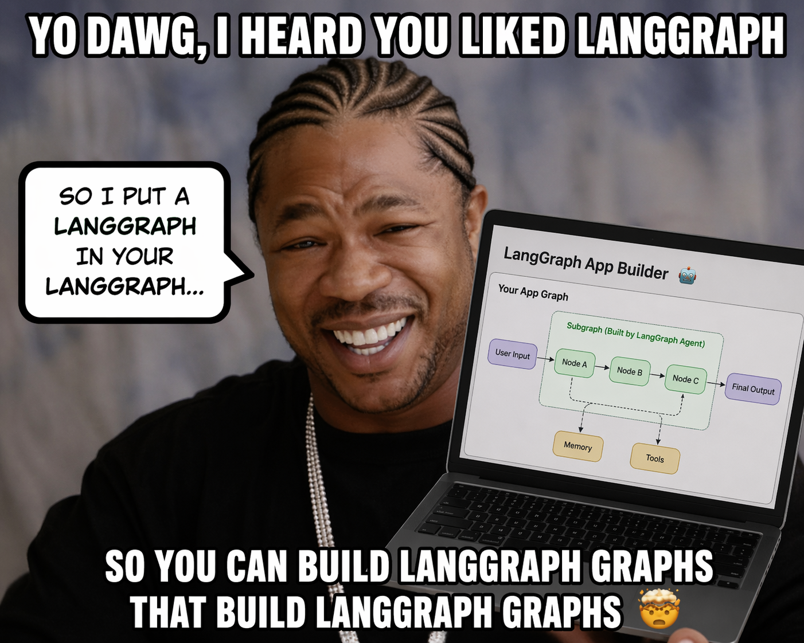
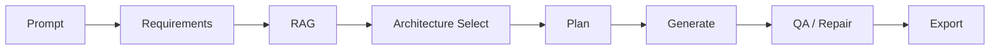
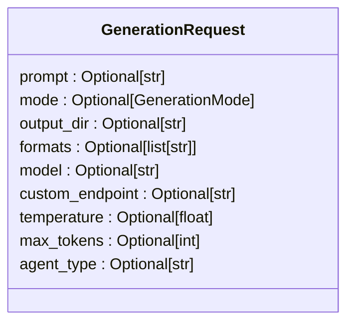

# langgraph_system_generator

Prompt -> full agentic system. LangGraph System Generator, also called LNF,
turns a natural-language request into runnable LangGraph notebook artifacts,
exports, and structured QA feedback.



## Features

- **CLI, API, and web UI**: Generate from `lnf`, FastAPI, or the browser UI.
- **Offline-friendly stub mode**: Produce deterministic scaffold artifacts
  without API keys.
- **Live generation mode**: Use an OpenAI-compatible model for requirements,
  architecture, graph, tool, and notebook generation.
- **Registry-backed planning**: Architecture, graph design, tool planning,
  notebook composition, and QA/repair stages expose structured feedback.
- **Portable notebooks**: Generated notebooks target local Jupyter and Google
  Colab.
- **Multi-format export**: Write IPYNB, HTML, Markdown, DOCX, ZIP, and optional
  PDF outputs.

## Quickstart

1. Create a Python `3.10+` virtual environment and install the package:

   ```bash
   python -m venv .venv
   source .venv/bin/activate  # Windows: .venv\Scripts\activate
   pip install -r requirements.txt
   pip install -e ".[full]"
   ```

   Install profiles:

   - `pip install -e .` installs the core Python package/config/types only.
   - `pip install -e ".[api]"` installs the FastAPI/web server.
   - `pip install -e ".[full]"` installs notebook generation, export, and live-mode dependencies.
   - `pip install -e ".[full,dev]"` installs contributor/test tooling.

2. Copy `.env.example` to `.env` and add credentials when you need live mode:

   ```bash
   cp .env.example .env
   ```

   Stub mode does not need provider credentials. Live mode requires
   `OPENAI_API_KEY` unless you provide an OpenAI-compatible `custom_endpoint`
   and explicit `model` through the API.

3. Optionally build the vector index from cached docs:

   ```bash
   lnf build-index --cache ./data/cached_docs --store ./data/vector_store
   ```

   The default index build uses local fake embeddings for offline testing. Add
   `--use-openai` when `OPENAI_API_KEY` is configured and you want OpenAI-backed
   semantic retrieval.

4. Generate your first system:

   ```bash
   lnf generate "Create a router-based customer support chatbot" \
     --output ./output/demo \
     --mode stub
   ```

5. Run the test suite when developing:

   ```bash
   python -m pytest --asyncio-mode=auto
   ```

## How It Works

LNF uses a staged outer LangGraph workflow to turn a prompt into notebook
artifacts.


```mermaid
graph LR
    Prompt[Prompt] --> Requirements[Requirements]
    Requirements --> RAG[RAG]
    RAG --> Architecture[Architecture Select]
    Architecture --> Plan[Plan]
    Plan --> Generate[Generate]
    Generate --> QA[QA / Repair]
    QA --> Export[Export]
```

Pipeline stages:

1. **Prompt**: The CLI, API, or web UI collects request options.
2. **Requirements**: `RequirementsAnalyst` extracts typed constraints plus
    advisory feedback.
3. **RAG**: `DocsRetriever` provides cached LangChain/LangGraph context.
4. **Architecture**: `ArchitectureSelector` chooses `router`, `subagents`,
   `hybrid`, or `autoagent`; explicit opt-in requests can select the
   experimental `deepagents` architecture.
5. **Plan**: `GraphDesigner` and `ToolchainEngineer` turn the selected
   architecture into a typed workflow design, graph exports, tool plan, and
   planning feedback.
6. **Generate**: `NotebookComposer` builds cells, a dependency plan, fallback
   feedback, and a graph overview section.
7. **QA / Repair**: Static/runtime QA validate the notebook; deterministic
   registry-backed repair runs only when needed and records rollback/no-op
   outcomes.
8. **Export**: The CLI/API export layer writes notebook artifacts and a manifest
   with structured feedback and warnings.

The same pipeline powers all three entry points:

- **CLI** for local generation and index building.
- **FastAPI + web UI** for browser-based generation and downloads.
- **Python package imports** for reuse in scripts and tests.

For stage-by-stage state details, fallback behavior, and repair-loop semantics,
see [docs/wiki/Architecture-Deep-Dive.md](docs/wiki/Architecture-Deep-Dive.md).
For developer-focused onboarding and extension notes, see
[docs/wiki/Developer-Onboarding.md](docs/wiki/Developer-Onboarding.md).
For runnable and text-only workflow examples, see
[examples/cross-cutting-workflows.md](examples/cross-cutting-workflows.md).
For maintainer-focused repository visualizations, including the generator
stage/state map and generated package/module/env snapshots, see
[docs/diagrams/README.md](docs/diagrams/README.md).

## CLI

Generate artifacts:

```bash
# Stub mode, no API key required
lnf generate "Create a router-based chatbot" --output ./output/demo --mode stub

# Force an architecture
lnf generate "Create an autonomous planning assistant" \
  --mode stub \
  --agent-type autoagent

# Opt into the experimental Deep Agents architecture
lnf generate "Create a Deep Agents research assistant" \
  --mode stub \
  --agent-type deepagents

# Select output formats. Default: ipynb html markdown docx zip
lnf generate "Create a chatbot" \
  --output ./output/demo \
  --formats ipynb html markdown docx zip

# Increase CLI verbosity for debugging/tracing fallback/error behavior
lnf --log-level DEBUG generate "Create a router-based chatbot" \
  --output ./output/debug
```

Pass `--mode live` to `lnf generate` when you have `OPENAI_API_KEY` configured and want to invoke the full generator graph.
For API and CLI default verbosity, set `LNF_LOG_LEVEL` (or `LOG_LEVEL`) to one of:
`TRACE`, `DEBUG`, `INFO`, `WARNING`, `ERROR`, `CRITICAL`.

Build the docs index:

```bash
# Offline test index
lnf build-index

# OpenAI-backed semantic index
lnf build-index --use-openai
```

CLI options intentionally stay narrow. Use the API for request-scoped `model`,
`temperature`, `max_tokens`, or `custom_endpoint` overrides.

## Expected Outputs And Feedback

Successful generations can include:

- `manifest.json`: Generation metadata, structured feedback, warnings, and
  per-format export status.
- `notebook_plan.json`: Notebook planning metadata.
- `generated_cells.json`: Raw cell specifications.
- `notebook.ipynb`: Runnable Jupyter/Colab notebook.
- `notebook.html`: HTML export.
- `notebook.md`: Markdown export.
- `notebook.docx`: Word document export.
- `notebook.pdf`: Optional PDF export.
- `notebook_bundle.zip`: Bundle with the notebook, requested exports, and JSON
  artifacts.

The manifest includes advisory fields such as `requirements_feedback`,
`architecture_feedback`, `graph_design_feedback`, `graph_exports`,
`tool_planning_feedback`, `generation_context_pack`,
`notebook_composition_feedback`,
`notebook_dependency_plan`, `qa_repair_feedback`, `qa_reports`, and
`qa_summary`. These are response/output fields, not new request fields.

Use `manifest.json` as the primary summary for:

- the selected architecture and generation mode
- export success or failure per artifact
- warning surfaces and fallback paths
- the docs, registry, notebook-contract, and QA context made available to the
  generation stages
- repair attempt history, QA findings, and next-step hints
- exact QA advisory details, severity classification, and whether artifacts
  remain usable
- artifact paths that can be downloaded through `GET /artifacts`

## API And Web UI

Start the FastAPI server:

```bash
uvicorn langgraph_system_generator.api.server:app --host 0.0.0.0 --port 8000
```

Open `http://localhost:8000` for the web UI.

REST endpoints:

- `GET /`: Web interface.
- `GET /health`: Health check.
- `POST /generate`: Synchronous generation.
- `POST /generate-async`: Start an async generation job.
- `GET /stream/{job_id}`: Server-Sent Events progress stream. Supports
  `Last-Event-ID` replay.
- `GET /artifacts?path=...`: Download a generated artifact path listed in the
  manifest.

Example:

```bash
curl -X POST http://localhost:8000/generate \
  -H "Content-Type: application/json" \
  -d '{
    "prompt": "Create a customer support chatbot with routing",
    "mode": "stub",
    "output_dir": "./output/my_system",
    "formats": ["ipynb", "html", "markdown", "docx", "zip"]
  }'
```

Request fields are `prompt`, `mode`, `output_dir`, `formats`, `model`,
`custom_endpoint`, `temperature`, `max_tokens`, and `agent_type`.

Current API request model snapshot:


```mermaid
classDiagram
  class GenerationRequest {
    prompt : Optional[str]
    mode : Optional[GenerationMode]
    output_dir : Optional[str]
    formats : Optional[list[str]]
    model : Optional[str]
    custom_endpoint : Optional[str]
    temperature : Optional[float]
    max_tokens : Optional[int]
    agent_type : Optional[str]
  }
```

Current web UI model presets under **Advanced Options → Model** are:

- `gpt-5.5`
- `gpt-5.4`
- `gpt-5.4-mini`
- `gpt-5.4-nano`
- `gpt-5.2`
- `gpt-5.2-chat-latest`
- `gpt-5.1`
- `gpt-5-mini`
- `gpt-5-nano`

The API accepts `model` as a string so these IDs can also be supplied directly
in API requests.

## Deploy to Google Cloud Run

This repository includes `.github/workflows/deploy-cloud-run.yml` to deploy the
containerized FastAPI app to Google Cloud Run on every push to `main`.

### 1) Configure GitHub repository variables

Add these **Repository Variables** in GitHub:

- `GCP_PROJECT_ID`: Your Google Cloud project ID.
- `GCP_REGION`: Cloud Run + Artifact Registry region (for example `us-central1`).
- `GCP_CLOUD_RUN_SERVICE`: Cloud Run service name to deploy.
- `GCP_ARTIFACT_REGISTRY_REPOSITORY`: Artifact Registry Docker repository name.
- `GCP_OPENAI_API_KEY_SECRET`: Secret Manager secret name to mount as
  `OPENAI_API_KEY` for live mode, for example `OPENAI_API_KEY`.

### 2) Configure GitHub repository secrets

Add these **Repository Secrets** in GitHub:

- `GCP_WORKLOAD_IDENTITY_PROVIDER`: Full Workload Identity Provider resource,
  for example:
  `projects/123456789/locations/global/workloadIdentityPools/github/providers/my-provider`
- `GCP_SERVICE_ACCOUNT`: Service account email used by GitHub Actions, for
  example `github-actions-deployer@my-project.iam.gserviceaccount.com`

### 3) Grant the service account required IAM roles

At minimum, grant roles needed to push images and deploy Cloud Run:

- Artifact Registry write access
- Cloud Run admin/developer access
- Service account user (for the Cloud Run runtime service account if needed)
- Secret Manager Secret Accessor on the configured OpenAI key secret for the
  deploy identity and Cloud Run runtime service account.

Live mode in Cloud Run reads `OPENAI_API_KEY` from Google Secret Manager at
container startup. The workflow mounts the configured
`GCP_OPENAI_API_KEY_SECRET` as the runtime environment variable
`OPENAI_API_KEY`; it does not use the GitHub repository secret named
`OPENAI_API_KEY` for Cloud Run runtime credentials.

The deployment workflow sets the Cloud Run memory limit to `2Gi`. Live
generation can exceed the Cloud Run default of `512Mi` while loading the app,
running model-backed generation, and packaging notebook artifacts.

### 4) Trigger deployment

- Push to `main` (automatic), or
- Run the **Deploy to Cloud Run** workflow manually from GitHub Actions.

### 5) Configure GitHub Actions environment protections (optional)

The deploy job targets the GitHub Actions environment `production`.

- If `production` has protection rules (required reviewers or wait timers),
  deployments pause until those checks are satisfied.
- If you want fully automatic deploys on push to `main`, keep `production`
  protections disabled or configured to auto-allow your workflow path.

Review or adjust this in **Settings → Environments → production**.

The workflow builds and pushes:

`$GCP_REGION-docker.pkg.dev/$GCP_PROJECT_ID/$GCP_ARTIFACT_REGISTRY_REPOSITORY/langgraph-system-generator:$GITHUB_SHA`

Then it deploys that image to `GCP_CLOUD_RUN_SERVICE`.

## Colab Usage

Generated notebooks are intended to run in local Jupyter and Google Colab.

1. Generate or download `notebook.ipynb`.
2. Upload it to Google Drive and open it in Colab.
3. Run the generated setup/install cell. It is built from the notebook
   dependency plan, so it only installs the packages the notebook needs.
4. Configure only the provider credentials referenced by the generated
   notebook, usually `OPENAI_API_KEY`.
5. Run the notebook top-to-bottom. Use `--mode stub` when you want an
   offline-friendly scaffold.

For details, see [docs/wiki/Colab-Usage.md](docs/wiki/Colab-Usage.md).

## Pattern Library

The generator-backed core patterns are:

- `RouterPattern`: Dynamic routing to specialized handlers.
- `SubagentsPattern`: Supervisor-based coordination of specialist workers.
- `HybridPattern`: Router plus worker/team composition.
- `AutoAgentPattern`: Planner/executor/critic-style autonomous workflow.
- `DeepAgentsPattern`: Experimental optional Deep Agents SDK harness using
  lazy `create_deep_agent(...)` imports and deterministic offline fallback.
- `CritiqueLoopPattern`: Iterative generation, critique, and revision.

See [docs/patterns.md](docs/patterns.md),
[docs/wiki/Pattern-Library-Guide.md](docs/wiki/Pattern-Library-Guide.md), and
the runnable examples under [examples/](examples/).

## Configuration

Common environment variables:

- `OPENAI_API_KEY`: OpenAI-compatible live-mode credentials.
- `ANTHROPIC_API_KEY`: Optional provider credential for generated notebooks that
  use Anthropic-backed tools.
- `LANGSMITH_API_KEY` and `LANGSMITH_PROJECT`: Optional tracing.
- `VECTOR_STORE_TYPE` and `VECTOR_STORE_PATH`: Retrieval index configuration.
- `DEFAULT_MODEL`: Default live model, currently `gpt-5-mini`.
- `MAX_REPAIR_ATTEMPTS`: Bounded QA repair loop count.
- `LNF_OUTPUT_BASE`: Constrains production-facing output paths.
- `LNF_MAX_CONCURRENT_GENERATIONS`: Async API generation concurrency.

Internal extension hooks accept JSON arrays or comma-separated module names:

- `GRAPH_DESIGNER_PLUGIN_MODULES`
- `NOTEBOOK_COMPOSER_PLUGIN_MODULES`
- `TOOLCHAIN_ENGINEER_PLUGIN_MODULES`
- `QA_REPAIR_PLUGIN_MODULES`

These hooks are internal-first extension points; they do not add public CLI/API
request fields.

## Extension Points

The generator keeps runtime extension hooks behind environment variables so the
public CLI/API contract stays stable:

| Surface | Environment variable | Expected registration function |
| --- | --- | --- |
| Graph design | `GRAPH_DESIGNER_PLUGIN_MODULES` | `register_graph_designers(registry)` |
| Notebook composition | `NOTEBOOK_COMPOSER_PLUGIN_MODULES` | `register_notebook_composer_builders(registry)` |
| Tool planning | `TOOLCHAIN_ENGINEER_PLUGIN_MODULES` | `register_toolchain_tools(registry)` |
| QA / repair | `QA_REPAIR_PLUGIN_MODULES` | `register_qa_repair_plugins(registry)` |

Each value can be a JSON array or a comma-separated list of dotted module
paths. These hooks extend internal registries; they do not create new request
fields or change the top-level `lnf generate` flags.

## Logging And Tracing

Use the built-in logging helpers for local debugging and CI runs:

- `LNF_LOG_LEVEL` or `LOG_LEVEL` sets the default log level.
- `lnf ... --log-level DEBUG` overrides logging for CLI runs.
- FastAPI uses the same shared logging configuration during server startup.
- `GET /stream/{job_id}` exposes progress events for async API generations.

For trace collection in live LangChain/LangGraph runs, set
`LANGSMITH_API_KEY` and `LANGSMITH_PROJECT`. The current LangSmith guidance for
LangGraph tracing is documented at
[Trace LangGraph applications](https://docs.langchain.com/langsmith/trace-with-langgraph).

## Developing Locally

Useful local commands:

```bash
python -m pip install --upgrade pip
pip install -r requirements.txt
pip install -e ".[full,dev]"
python -m pytest tests/unit --asyncio-mode=auto -q
python -m pytest --asyncio-mode=auto
black src/ tests/
ruff check src/ tests/
mypy src/
```

Release-readiness checks:

```bash
# Local deterministic LangGraph release evaluation, no LangSmith upload
python scripts/run_release_eval.py --no-upload

# Isolated install matrix smoke tests for the documented package extras
RUN_PACKAGING_SMOKE=1 PACKAGING_SMOKE_SCENARIOS=minimal,api python -m pytest tests/integration/test_packaging_install_smoke.py -q
RUN_PACKAGING_SMOKE=1 PACKAGING_SMOKE_SCENARIOS=full python -m pytest tests/integration/test_packaging_install_smoke.py -q
```

When editing docs only, the narrowest useful validation is:

```bash
python -m pytest tests/unit/test_documentation_coverage.py -q
```

Use stub mode for the fastest local verification loop:

```bash
lnf generate "Create a router-based customer support chatbot" \
  --output ./output/docs-smoke \
  --mode stub
```

More docs:

- [Getting Started](docs/wiki/Getting-Started.md)
- [Architecture Deep Dive](docs/wiki/Architecture-Deep-Dive.md)
- [CLI and API Reference](docs/wiki/CLI-and-API-Reference.md)
- [Developer Onboarding](docs/wiki/Developer-Onboarding.md)
- [Colab Usage](docs/wiki/Colab-Usage.md)
- [Development Guide](docs/dev.md)
- [Repository Visualizations](docs/diagrams/README.md)
- [Changelog](CHANGELOG.md)
- [License](LICENSE)
