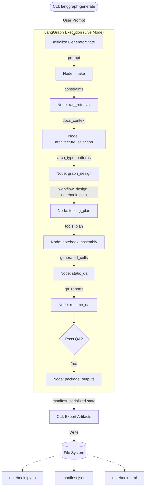

# LangGraph System Generator: Dynamic View & Flow Analysis

This document provides a function and data-flow oriented view of the `langgraph_system_generator` library. It traces the "Happy Path" execution flow from the CLI entry point through the LangGraph generation pipeline to the final artifact export.

## 1. System Visualization (Happy Path)

---

## 2. Detailed Step-by-Step Breakdown

### Step 1: Entry Point & Initialization
*   **Goal**: Parse user arguments, initialize the state, and trigger the generation graph.
*   **Graph Node**: N/A (External Trigger)
*   **Routing/File**: `src/langgraph_system_generator/cli.py`
*   **Core Logic**: `cli.generate_artifacts` calls `graph.create_generator_graph().ainvoke(...)`
*   **Data Flow**:
    *   **Writes**: `user_prompt` (Initial State)

### Step 2: Requirement Analysis (Intake)
*   **Goal**: Analyze the user's raw prompt to extract structured constraints and requirements.
*   **Graph Node**: `intake`
*   **Routing/File**: `src/langgraph_system_generator/generator/nodes.py` -> `intake_node`
*   **Core Logic**: `src/langgraph_system_generator/generator/agents/requirements_analyst.py` -> `RequirementsAnalyst.analyze`
*   **Data Flow**:
    *   **Reads**: `user_prompt`
    *   **Writes**: `constraints` (List[Constraint])

### Step 3: Context Retrieval (RAG)
*   **Goal**: Retrieve relevant documentation and patterns from the vector store to inform design.
*   **Graph Node**: `rag_retrieval`
*   **Routing/File**: `src/langgraph_system_generator/generator/nodes.py` -> `rag_retrieval_node`
*   **Core Logic**: `src/langgraph_system_generator/rag/retriever.py` -> `DocsRetriever.retrieve`
*   **Data Flow**:
    *   **Reads**: `user_prompt`
    *   **Writes**: `docs_context` (List[DocSnippet])

### Step 4: Architecture Selection
*   **Goal**: select the high-level LangGraph pattern (e.g., Router, Subagents, Hybrid) best suited for the requirements.
*   **Graph Node**: `architecture_selection`
*   **Routing/File**: `src/langgraph_system_generator/generator/nodes.py` -> `architecture_selection_node`
*   **Core Logic**: `src/langgraph_system_generator/generator/agents/architecture_selector.py` -> `ArchitectureSelector.select_architecture`
*   **Data Flow**:
    *   **Reads**: `constraints`, `docs_context`
    *   **Writes**: `selected_patterns`, `architecture_type`, `architecture_justification`

### Step 5: Workflow Design
*   **Goal**: Design the detailed graph topology, including nodes, edges, and state definitions. Also outlines the notebook structure.
*   **Graph Node**: `graph_design`
*   **Routing/File**: `src/langgraph_system_generator/generator/nodes.py` -> `graph_design_node`
*   **Core Logic**: `src/langgraph_system_generator/generator/agents/graph_designer.py` -> `GraphDesigner.design_workflow`
*   **Data Flow**:
    *   **Reads**: `selected_patterns`, `architecture_type`, `constraints`, `architecture_justification`
    *   **Writes**: `workflow_design` (Dict), `notebook_plan` (NotebookPlan)

### Step 6: Tooling Planning
*   **Goal**: Define the specific tools and libraries required for the agents to function within the designed workflow.
*   **Graph Node**: `tooling_plan`
*   **Routing/File**: `src/langgraph_system_generator/generator/nodes.py` -> `tooling_plan_node`
*   **Core Logic**: `src/langgraph_system_generator/generator/agents/toolchain_engineer.py` -> `ToolchainEngineer.plan_tools`
*   **Data Flow**:
    *   **Reads**: `workflow_design`, `constraints`
    *   **Writes**: `tools_plan` (List)

### Step 7: Notebook Assembly (Code Generation)
*   **Goal**: Generate the actual Python code cells for the Jupyter notebook based on the design plans.
*   **Graph Node**: `notebook_assembly`
*   **Routing/File**: `src/langgraph_system_generator/generator/nodes.py` -> `notebook_assembly_node`
*   **Core Logic**: `src/langgraph_system_generator/generator/agents/notebook_composer.py` -> `NotebookComposer.compose_notebook`
*   **Data Flow**:
    *   **Reads**: `notebook_plan`, `workflow_design`, `tools_plan`, `selected_patterns`, `architecture_justification`
    *   **Writes**: `generated_cells` (List[CellSpec])

### Step 8: Quality Assurance (Static & Runtime)
*   **Goal**: Validate the generated code against best practices and (conceptually) run it to check for errors.
*   **Graph Node**: `static_qa`, `runtime_qa`
*   **Routing/File**: `src/langgraph_system_generator/generator/nodes.py` -> `static_qa_node`, `runtime_qa_node`
*   **Core Logic**: `src/langgraph_system_generator/generator/agents/qa_repair_agent.py` -> `QARepairAgent.validate`
*   **Data Flow**:
    *   **Reads**: `generated_cells`
    *   **Writes**: `qa_reports` (List[QAReport])

### Step 9: Packaging & Completion
*   **Goal**: Compile metadata and signal that generation is complete.
*   **Graph Node**: `package_outputs`
*   **Routing/File**: `src/langgraph_system_generator/generator/nodes.py` -> `package_outputs_node`
*   **Core Logic**: N/A (Data aggregation)
*   **Data Flow**:
    *   **Reads**: `notebook_plan`, `generated_cells`, `architecture_type`, `constraints`
    *   **Writes**: `artifacts_manifest`, `generation_complete`

### Step 10: Artifact Export
*   **Goal**: Write the final generated content (JSON, IPYNB, HTML) to the user's disk.
*   **Graph Node**: N/A (CLI Post-processing)
*   **Routing/File**: `src/langgraph_system_generator/cli.py`
*   **Core Logic**: `NotebookExporter.export_ipynb`, `NotebookExporter.export_to_html` (via `manifest` data)
*   **Data Flow**:
    *   **Reads**: `result` (The final GeneratorState)
    *   **Writes**: `.ipynb`, `.json`, `.html`, `.docx`, `.zip` files

---

## 3. Data Schema Snapshot (AgentState)

The `GeneratorState` acts as the central data bus. Below is the mapping of how data evolves through the system.

| State Key | Type | Populated By (Node) | Consumed By (Node) |
| :--- | :--- | :--- | :--- |
| **user_prompt** | `str` | CLI (Init) | `intake`, `rag_retrieval` |
| **constraints** | `List[Constraint]` | `intake` | `architecture_selection`, `graph_design`, `tooling_plan` |
| **docs_context** | `List[DocSnippet]` | `rag_retrieval` | `architecture_selection` |
| **selected_patterns** | `Dict` | `architecture_selection` | `graph_design`, `notebook_assembly` |
| **architecture_type** | `str` | `architecture_selection` | `graph_design`, `package_outputs` |
| **architecture_justification** | `str` | `architecture_selection` | `graph_design`, `notebook_assembly` |
| **workflow_design** | `Dict` | `graph_design` | `tooling_plan`, `notebook_assembly` |
| **notebook_plan** | `NotebookPlan` | `graph_design` | `notebook_assembly`, `package_outputs` |
| **tools_plan** | `List` | `tooling_plan` | `notebook_assembly` |
| **generated_cells** | `List[CellSpec]` | `notebook_assembly` | `static_qa`, `runtime_qa`, `repair`, `package_outputs` |
| **qa_reports** | `List[QAReport]` | `static_qa`, `runtime_qa` | `repair` (conditional edge logic) |
| **repair_attempts** | `int` | `repair` | `repair` (conditional edge logic) |
| **artifacts_manifest** | `Dict` | `package_outputs` | CLI (Export) |