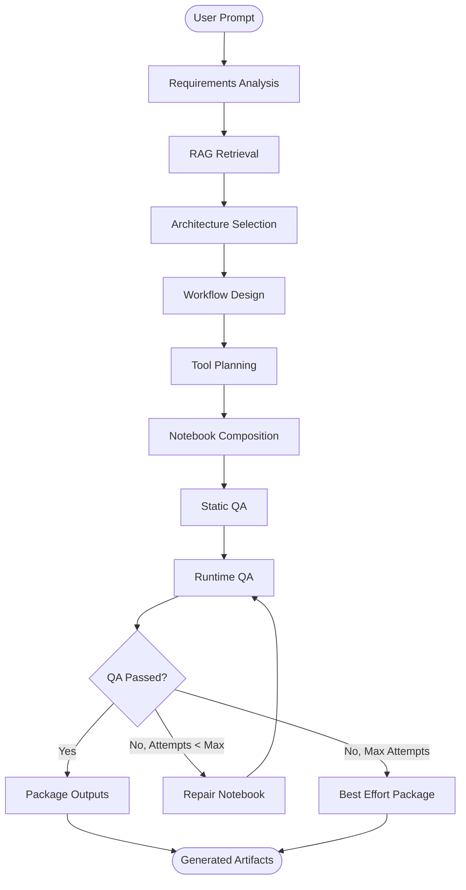

# Architecture Deep Dive

This guide explains the internal architecture of LangGraph System Generator and how the generation pipeline transforms prompts into complete multi-agent systems.

## Overview

LangGraph System Generator follows a **linear pipeline architecture** with conditional repair loops. Each stage processes and enriches the state, ultimately producing complete, runnable Jupyter notebooks.

## Generation Pipeline



### Pipeline Stages

#### 1. Requirements Analysis (Intake)
**Input**: User prompt  
**Output**: Structured constraints

The Requirements Analyst extracts structured constraints from the natural language prompt:

```python
{
  "user_prompt": "Create a customer support chatbot with routing",
  "constraints": [
    {"type": "architecture", "value": "routing", "priority": 1},
    {"type": "domain", "value": "customer support", "priority": 1},
    {"type": "capability", "value": "classification", "priority": 2}
  ]
}
```

**Agent**: `RequirementsAnalyst`  
**LLM-Powered**: Yes (live mode) / Heuristics (stub mode)

#### 2. RAG Retrieval
**Input**: Constraints  
**Output**: Relevant documentation snippets

Retrieves relevant LangGraph/LangChain documentation based on the requirements:

```python
{
  "docs_context": [
    {
      "source": "langgraph/concepts/state",
      "heading": "State Management",
      "content": "LangGraph uses TypedDict for state...",
      "relevance_score": 0.92
    },
    {
      "source": "langgraph/patterns/router",
      "heading": "Router Pattern",
      "content": "Dynamic routing to specialized nodes...",
      "relevance_score": 0.89
    }
  ]
}
```

**Components**: `DocsRetriever`, `VectorStoreManager`  
**Vector Store**: FAISS with OpenAI embeddings

#### 3. Architecture Selection
**Input**: Constraints + Documentation context  
**Output**: Selected architecture and justification

Selects the most appropriate multi-agent pattern:

```python
{
  "architecture_type": "router",
  "architecture_justification": "Router pattern selected for customer support routing based on classification requirements",
  "selected_patterns": {
    "primary": "router",
    "secondary": null,
    "hybrid": false
  }
}
```

**Available Architectures**:
- `router`: Dynamic routing pattern
- `subagents`: Supervisor-subagent coordination
- `critique_revise`: Iterative refinement loop
- `hybrid`: Combination of multiple patterns

**Agent**: `ArchitectureSelector`  
**LLM-Powered**: Yes (live mode) / Heuristics (stub mode)

#### 4. Workflow Design
**Input**: Architecture + Constraints + Docs  
**Output**: Detailed workflow specification

Designs the specific graph structure, nodes, and edges:

```python
{
  "workflow_design": {
    "nodes": [
      {"name": "router", "type": "classifier", "purpose": "Route to appropriate handler"},
      {"name": "technical_support", "type": "handler", "purpose": "Handle technical queries"},
      {"name": "billing_support", "type": "handler", "purpose": "Handle billing queries"},
      {"name": "general_support", "type": "handler", "purpose": "Handle general queries"}
    ],
    "edges": [
      {"from": "router", "to": "technical_support", "condition": "route == 'technical'"},
      {"from": "router", "to": "billing_support", "condition": "route == 'billing'"},
      {"from": "router", "to": "general_support", "condition": "route == 'general'"}
    ],
    "entry_point": "router",
    "graph_type": "conditional"
  }
}
```

**Agent**: `GraphDesigner`  
**LLM-Powered**: Yes (live mode) / Template-based (stub mode)

#### 5. Tool Planning
**Input**: Workflow design + Constraints  
**Output**: Tool specifications

Plans any tools/functions needed by the agents:

```python
{
  "tools_plan": [
    {
      "name": "search_knowledge_base",
      "purpose": "Search internal documentation",
      "parameters": ["query: str"],
      "returns": "List[Document]"
    },
    {
      "name": "create_ticket",
      "purpose": "Create support ticket",
      "parameters": ["title: str", "description: str", "priority: str"],
      "returns": "Ticket"
    }
  ]
}
```

**Agent**: `ToolchainEngineer`  
**LLM-Powered**: Yes (live mode) / Basic stubs (stub mode)

#### 6. Notebook Composition
**Input**: All previous context  
**Output**: Complete notebook cells

Generates the actual notebook structure:

```python
{
  "notebook_plan": {
    "title": "Customer Support Router System",
    "sections": [
      "Setup & Configuration",
      "State Definition",
      "Node Implementation",
      "Graph Construction",
      "Execution & Testing"
    ],
    "cell_count_estimate": 12,
    "architecture_type": "router",
    "patterns_used": ["router"]
  },
  "generated_cells": [
    {
      "cell_type": "markdown",
      "section": "Setup & Configuration",
      "content": "# Customer Support Router System\n\n..."
    },
    {
      "cell_type": "code",
      "section": "Setup & Configuration",
      "content": "!pip install langgraph langchain langchain-openai\nimport os\n..."
    },
    # ... more cells
  ]
}
```

**Agent**: `NotebookComposer`  
**LLM-Powered**: Yes (live mode) / Template-based (stub mode)

#### 7. Static QA
**Input**: Generated cells  
**Output**: QA reports

Validates notebook structure without execution:

```python
{
  "qa_reports": [
    {
      "check_name": "json_structure",
      "passed": true,
      "message": "Notebook structure is valid"
    },
    {
      "check_name": "required_sections",
      "passed": true,
      "message": "All required sections present"
    },
    {
      "check_name": "no_placeholders",
      "passed": true,
      "message": "No placeholder text found"
    }
  ]
}
```

**Checks**:
- JSON structure validity
- Required sections presence
- No placeholder text
- Required imports present

**Component**: `NotebookValidator`

#### 8. Runtime QA
**Input**: Notebook file  
**Output**: Additional QA reports

Validates that the notebook can compile and execute:

```python
{
  "qa_reports": [
    # ... previous static QA reports ...
    {
      "check_name": "graph_compiles",
      "passed": true,
      "message": "Graph construction compiles successfully"
    }
  ]
}
```

**Component**: `NotebookValidator` (compilation checks)

#### 9. Repair Loop
**Input**: Notebook + Failed QA reports  
**Output**: Repaired notebook

If QA fails, attempts to repair the notebook:

```python
{
  "repair_attempts": 1,
  "qa_reports": [
    # ... updated reports after repair ...
  ]
}
```

**Repair Strategy**:
1. Identify specific failures
2. Generate targeted fixes
3. Apply fixes to notebook
4. Re-run QA validation
5. Repeat up to `MAX_REPAIR_ATTEMPTS` (default: 3)

**Component**: `NotebookRepairAgent`  
**LLM-Powered**: Yes (live mode only)

#### 10. Package Outputs
**Input**: Final notebook  
**Output**: Multiple formats + manifest

Exports the notebook to various formats:

```python
{
  "artifacts_manifest": {
    "notebook_path": "./output/system/notebook.ipynb",
    "html_path": "./output/system/notebook.html",
    "docx_path": "./output/system/notebook.docx",
    "pdf_path": "./output/system/notebook.pdf",  # optional
    "zip_path": "./output/system/notebook_bundle.zip",
    "manifest_path": "./output/system/manifest.json",
    "plan_path": "./output/system/notebook_plan.json",
    "cells_path": "./output/system/generated_cells.json"
  },
  "generation_complete": true
}
```

**Component**: `NotebookExporter`

## State Management

The entire pipeline operates on a single `GeneratorState` object that flows through each node:

```python
class GeneratorState(TypedDict):
    # Input
    user_prompt: str
    uploaded_files: Optional[List[str]]
    
    # Requirements Analysis
    constraints: Annotated[List[Constraint], operator.add]
    
    # RAG Retrieval
    docs_context: Annotated[List[DocSnippet], operator.add]
    
    # Architecture Selection
    architecture_type: Optional[str]
    architecture_justification: str
    selected_patterns: Dict[str, Any]
    
    # Workflow Design
    workflow_design: Optional[Dict[str, Any]]
    
    # Tool Planning
    tools_plan: Optional[List[Dict[str, Any]]]
    
    # Notebook Composition
    notebook_plan: Optional[NotebookPlan]
    generated_cells: Annotated[List[CellSpec], operator.add]
    
    # QA & Repair
    qa_reports: List[QAReport]
    repair_attempts: int
    
    # Output
    artifacts_manifest: Dict[str, str]
    generation_complete: bool
    error_message: Optional[str]
```

**Key Features**:
- **Annotated Lists**: Fields like `constraints` use `operator.add` for merging across parallel nodes
- **Immutability**: State updates create new state versions (LangGraph managed)
- **Type Safety**: TypedDict provides IDE autocomplete and validation

## Component Architecture

### Core Agents

Each pipeline stage has a dedicated agent:

| Agent | Responsibility | LLM? |
|-------|---------------|------|
| `RequirementsAnalyst` | Extract constraints from prompts | Live mode |
| `ArchitectureSelector` | Choose optimal pattern | Live mode |
| `GraphDesigner` | Design workflow structure | Live mode |
| `ToolchainEngineer` | Plan required tools | Live mode |
| `NotebookComposer` | Generate notebook cells | Live mode |
| `QARepairAgent` | Fix validation failures | Live mode |

### Support Components

| Component | Purpose |
|-----------|---------|
| `DocsRetriever` | Semantic search over cached docs |
| `VectorStoreManager` | FAISS index management |
| `DocumentCache` | Cached documentation storage |
| `NotebookValidator` | Static & runtime validation |
| `NotebookExporter` | Multi-format export |
| `PatternLibrary` | Reusable pattern templates |

## Stub vs Live Mode

### Stub Mode
**Purpose**: Fast generation without API calls

**Characteristics**:
- ✅ No API key required
- ✅ Instant generation (< 1 second)
- ✅ Deterministic output
- ❌ Limited customization
- ❌ Template-based patterns only
- ❌ No context-aware generation

**Use Cases**:
- Quick prototyping
- Testing pipeline
- Offline development
- CI/CD integration

### Live Mode
**Purpose**: Full LLM-powered generation

**Characteristics**:
- ✅ Context-aware generation
- ✅ Highly customized output
- ✅ Intelligent pattern selection
- ✅ Detailed documentation
- ❌ Requires API key
- ❌ Slower (10-30 seconds)
- ❌ Non-deterministic

**Use Cases**:
- Production generation
- Complex requirements
- Custom architectures
- High-quality output

## RAG System

### Documentation Cache

Precached documentation includes:

- **LangGraph Core**: State, graphs, nodes, edges
- **LangGraph Patterns**: Router, subagents, supervisor
- **LangChain Core**: Chains, runnables, prompts
- **LangChain Agents**: Tools, agent executors
- **LangChain RAG**: Retrievers, vector stores

**Statistics**:
- 19+ pages
- ~300KB text
- All redirects filtered
- Minimal pages excluded

### Vector Store

**Implementation**: FAISS with OpenAI embeddings

**Index Structure**:
```
data/vector_store/
  ├── index.faiss       # FAISS index file
  └── index.pkl         # Document metadata
```

**Retrieval Process**:
1. Query embedding via OpenAI
2. Similarity search in FAISS (k=5 default)
3. Return top documents with relevance scores
4. Filter by minimum relevance threshold

## Pattern Library Integration

The Pattern Library provides code generation templates:

### Router Pattern
```python
# Generated code structure
1. State schema with routing field
2. Router node (LLM-based classification)
3. Route handler nodes (specialized processing)
4. Conditional edges (routing logic)
5. Graph compilation
```

### Subagents Pattern
```python
# Generated code structure
1. State schema with agent tracking
2. Supervisor node (delegation decisions)
3. Subagent nodes (specialized work)
4. Looping edges (supervisor ↔ agents)
5. Termination condition (FINISH signal)
```

### Critique-Revise Loop
```python
# Generated code structure
1. State schema with revision tracking
2. Generation node (initial output)
3. Critique node (quality assessment)
4. Revise node (improvement)
5. Conditional edges (quality threshold)
```

All patterns are:
- ✅ Production-tested (≥90% coverage)
- ✅ Fully documented
- ✅ Customizable
- ✅ Composable

## Quality Assurance System

### Validation Checks

| Check | Type | Description |
|-------|------|-------------|
| `json_structure` | Static | Valid notebook JSON |
| `required_sections` | Static | All sections present |
| `no_placeholders` | Static | No TODO/placeholder text |
| `imports_present` | Static | Required imports included |
| `graph_compiles` | Runtime | Code syntax validation |

### Repair Strategies

When QA fails, the repair agent:

1. **Analyzes failures**: Categorizes error types
2. **Generates fixes**: Creates targeted repairs
3. **Applies patches**: Updates specific cells
4. **Validates**: Re-runs QA checks
5. **Iterates**: Repeats if needed (max 3 attempts)

### Best-Effort Fallback

If repair fails after max attempts:
- Packages best available version
- Includes QA reports in manifest
- Logs warnings for manual review

## Export System

### Format Support

| Format | Extension | Use Case | Dependencies |
|--------|-----------|----------|--------------|
| Jupyter | `.ipynb` | Interactive execution | nbformat |
| HTML | `.html` | Viewing/sharing | nbconvert |
| DOCX | `.docx` | Editing/documentation | python-docx |
| PDF | `.pdf` | Print/archival | reportlab |
| ZIP | `.zip` | Bundle distribution | stdlib |

### Manifest Structure

Every generation produces a `manifest.json`:

```json
{
  "prompt": "Create a customer support chatbot with routing",
  "mode": "stub",
  "architecture": "router",
  "patterns": ["router"],
  "timestamp": "2024-01-17T18:00:00Z",
  "artifacts": {
    "notebook": "./notebook.ipynb",
    "html": "./notebook.html",
    "docx": "./notebook.docx",
    "zip": "./notebook_bundle.zip"
  },
  "qa_status": {
    "passed": true,
    "checks": 5,
    "failures": 0
  },
  "metadata": {
    "cells_generated": 12,
    "repair_attempts": 0,
    "generation_time_ms": 850
  }
}
```

## Configuration

Settings are managed via environment variables and Pydantic:

```python
class Settings(BaseSettings):
    # API Keys
    openai_api_key: Optional[str] = None
    anthropic_api_key: Optional[str] = None
    langsmith_api_key: Optional[str] = None
    
    # Vector Store
    vector_store_type: str = "faiss"
    vector_store_path: str = "./data/vector_store"
    
    # Generation
    default_model: str = "gpt-4-turbo-preview"
    max_repair_attempts: int = 3
    default_budget_tokens: int = 100000
    
    # LangSmith
    langsmith_project: Optional[str] = None
```

Access via:
```python
from langgraph_system_generator.utils.config import settings

print(settings.default_model)  # "gpt-4-turbo-preview"
```

## Extension Points

### Adding New Patterns

1. Create pattern module in `src/langgraph_system_generator/patterns/`
2. Implement standard methods:
   - `generate_state_code()`
   - `generate_graph_code()`
   - `generate_complete_example()`
3. Add tests in `tests/unit/test_patterns.py`
4. Update documentation

### Custom Agents

Inject custom agents into the pipeline:

```python
from langgraph_system_generator.generator.graph import create_generator_graph

# Create graph
workflow = create_generator_graph()

# Add custom node
def custom_analysis_node(state):
    # Your custom logic
    return {"custom_field": "value"}

workflow.add_node("custom_analysis", custom_analysis_node)
workflow.add_edge("intake", "custom_analysis")
workflow.add_edge("custom_analysis", "rag_retrieval")

# Compile and run
app = workflow.compile()
```

### Custom Validators

Add validation checks:

```python
from langgraph_system_generator.qa.validators import NotebookValidator

class CustomValidator(NotebookValidator):
    def check_custom_requirement(self, notebook_path):
        # Your validation logic
        return QAReport(
            check_name="custom_check",
            passed=True,
            message="Custom check passed"
        )
```

## Performance Characteristics

### Stub Mode
- **Generation time**: < 1 second
- **Memory usage**: ~50MB
- **API calls**: 0
- **Deterministic**: Yes

### Live Mode
- **Generation time**: 10-30 seconds
- **Memory usage**: ~200MB (includes LLM context)
- **API calls**: 5-10 (depending on complexity)
- **Deterministic**: No (LLM variability)

### Scalability
- **Concurrent generations**: Limited by API rate limits
- **Vector store**: Scales to 100K+ documents
- **Pattern library**: O(1) generation time
- **Export**: Linear with notebook size

## Troubleshooting

### Common Issues

**Issue**: Generation fails with timeout  
**Solution**: Increase timeout in settings or use stub mode

**Issue**: Vector store not found  
**Solution**: Run `python scripts/build_index.py` or use stub mode

**Issue**: QA validation fails  
**Solution**: Check QA reports in output directory, repair attempts logged

**Issue**: Export format not generated  
**Solution**: Check dependencies installed: `pip install -e ".[full]"`

---

**Next**: [Pattern Library Guide →](Pattern-Library-Guide.md) | [CLI & API Reference →](CLI-and-API-Reference.md)
