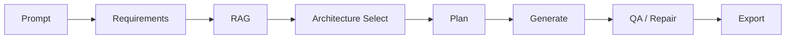

# Developer Onboarding

Use this page when you need the fastest path from cloning the repository to
understanding how the generator behaves, how to extend it, and what outputs to
expect.

## Start Here

Choose the entry point that matches your goal:

- **Read the overview**: [Home](Home.md)
- **Install and run the project**: [Getting Started](Getting-Started.md)
- **Understand the generator internals**:
  [Architecture Deep Dive](Architecture-Deep-Dive.md)
- **Inspect request/response shapes**:
  [CLI & API Reference](CLI-and-API-Reference.md)
- **Review runnable examples**: [examples/README.md](../../examples/README.md)

## How It Works

All entry points reuse the same outer LangGraph pipeline:



- **Requirements**: `RequirementsAnalyst` extracts typed constraints plus
  advisory `requirements_feedback`.
- **RAG**: `DocsRetriever` loads cached LangChain/LangGraph context when a
  vector store is available.
- **Architecture Select**: `ArchitectureSelector` picks a pattern such as
  `router`, `subagents`, `hybrid`, `autoagent`, or explicit opt-in
  `deepagents`.
- **Plan**: `GraphDesigner` and `ToolchainEngineer` produce workflow structure,
  tool plans, and validation feedback.
- **Generate**: `NotebookComposer` emits notebook cells, dependency guidance,
  and notebook-facing fallback notes.
- **QA / Repair**: Static QA, runtime QA, and deterministic repair produce
  `qa_reports`, `qa_history`, and `qa_repair_feedback`.
- **Export**: The packaging layer writes notebook artifacts plus `manifest.json`.

## Developing Locally

Use the full contributor install when editing docs, tests, or workflows:

```bash
python -m venv .venv
source .venv/bin/activate  # Windows: .venv\Scripts\activate
python -m pip install --upgrade pip
pip install -r requirements.txt
pip install -e ".[full,dev]"
```

Fast local smoke test:

```bash
lnf generate "Create a router-based support assistant" \
  --output ./output/onboarding-smoke \
  --mode stub
```

Stub mode is the fastest way to verify docs and examples because it does not
require provider credentials.

## Testing And Validation

Start with the narrowest check that matches your change:

```bash
python -m pytest tests/unit/test_documentation_coverage.py -q
python -m pytest tests/unit --asyncio-mode=auto -q
python -m pytest --asyncio-mode=auto
```

Formatting and static checks used by contributors:

```bash
black src/ tests/
ruff check src/ tests/
mypy src/
```

The repository also ships a dedicated documentation workflow so pull requests
surface missing coverage early.

## Logging And Tracing

For local debugging:

- Set `LNF_LOG_LEVEL` or `LOG_LEVEL` to `DEBUG`, `INFO`, `WARNING`, or `TRACE`.
- Use CLI `--log-level` to override the environment for a single run.
- Watch async API progress with `GET /stream/{job_id}`.

For LangSmith tracing in live-mode LangChain/LangGraph runs:

```bash
export LANGSMITH_API_KEY="..."
export LANGSMITH_PROJECT="langgraph-notebook-foundry"
```

Reference docs:

- [Trace LangGraph applications](https://docs.langchain.com/langsmith/trace-with-langgraph)
- [Trace LangChain applications](https://docs.langchain.com/langsmith/trace-with-langchain)

## Extension Points

Internal-first plugin hooks are loaded from environment variables. Each accepts a
JSON array or comma-separated list of dotted module paths.

| Extension surface | Environment variable | Expected registration function |
| --- | --- | --- |
| Graph design registry | `GRAPH_DESIGNER_PLUGIN_MODULES` | `register_graph_designers(registry)` |
| Notebook composer registry | `NOTEBOOK_COMPOSER_PLUGIN_MODULES` | `register_notebook_composer_builders(registry)` |
| Tool registry | `TOOLCHAIN_ENGINEER_PLUGIN_MODULES` | `register_toolchain_tools(registry)` |
| QA / repair registry | `QA_REPAIR_PLUGIN_MODULES` | `register_qa_repair_plugins(registry)` |

These are extension hooks for internal registries. They do not add new
top-level CLI flags or API request fields.

## Expected Artifacts And Feedback

Every generation is expected to produce some combination of:

- `notebook.ipynb`
- `notebook.html`
- `notebook.md`
- `notebook.docx`
- optional `notebook.pdf`
- `notebook_bundle.zip`
- `notebook_plan.json`
- `generated_cells.json`
- `manifest.json`

`manifest.json` is the main cross-cutting contract for debugging and support:

- selected architecture and generation mode
- export status per requested format
- advisory feedback such as `requirements_feedback`,
  `graph_design_feedback`, and `qa_repair_feedback`
- warning surfaces and next-step hints
- artifact paths for download APIs and manual inspection

## Cross-Cutting Workflow Examples

For prompt snippets and expected outputs covering testing, logging, plugin
loading, and artifact export, see
[examples/cross-cutting-workflows.md](../../examples/cross-cutting-workflows.md).
